<p align="center">
  
</p>
<h3 align="center">
Você no controle da sua rotina!
</h3>

<br><br>

<p align="center">
  
  
  
  
</p>
<br>

<p align="center">
  <a href="#sobre">Sobre</a> •
  <a href="#habits">Habits</a> •
  <a href="#instalação">Instalação</a> •
  <a href="#tecnologias">Tecnologias</a> •
  <a href="#autor">Autor</a>  
</p>

## Sobre

Projeto desenvolvido durante a NLW Setup, evento criado pela Rocketseat. Um evento 100% online e GRATUITO, com conteúdo exclusivo e INÉDITO.

Ocorreu do dia 16 ao dia 20 de Janeiro de 2023 e teve como intuito mostrar na prática o poder da stack NodeJS + ReactJS + React Native e como essas tecnologias podem te levar até os seus maiores objetivos como programador.

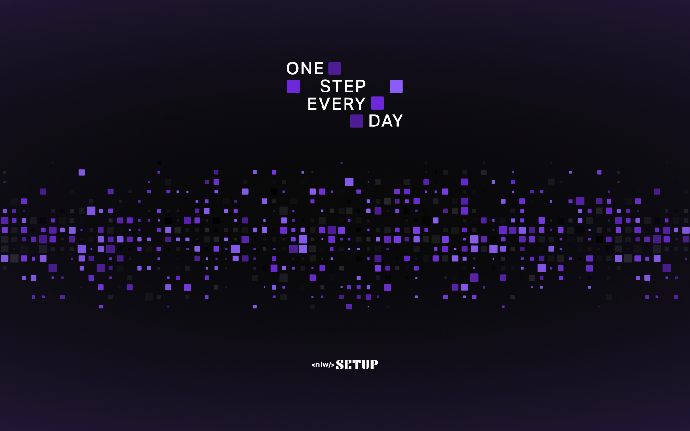

## Habits

O Habits é um app para monitoramento de tarefas diárias para auxiliar seus usuários a rastrear suas atividades realizadas e não realizadas.

O fluxo da aplicação é simples: o usuário cadastra os hábitos desejados indicando em quais dias da semana deverão ser realizados e todos os dias ele terá uma listas de hábitos de acordo com o dia atual, aonde ele irá indicar o status de cada hábito e a aplicação irá gerar um progresso diário que será ilustrado na barra de progresso e também nas cores dos quadrados que representam os dias onde cores mais claras representam números maiores de hábitos completos.

A aplicação possui, além do backend, aplicação web e mobile, as quais serão ilustradas a seguir.

### Habits - Aplicação web

Ao acessar a home da aplicação web o usuário irá se deparar com a página abaixo aonde será exibido um botão para cadastro de um novo hábito e vários quadrados os quais representam dias passados, dia atual e dia futuro. Como podemos ver a seguir, cada dia possui uma cor diferente, onde:

- Cinza indica que nenhum hábito foi realizado.
- Cores mais escuras indicam pouco progresso nos hábitos diários.
- Cores mais claras indicam muito progresso nos hábitos diários.
- Cinza com opacidade reduzida indica dias futuros e não são clicáveis.

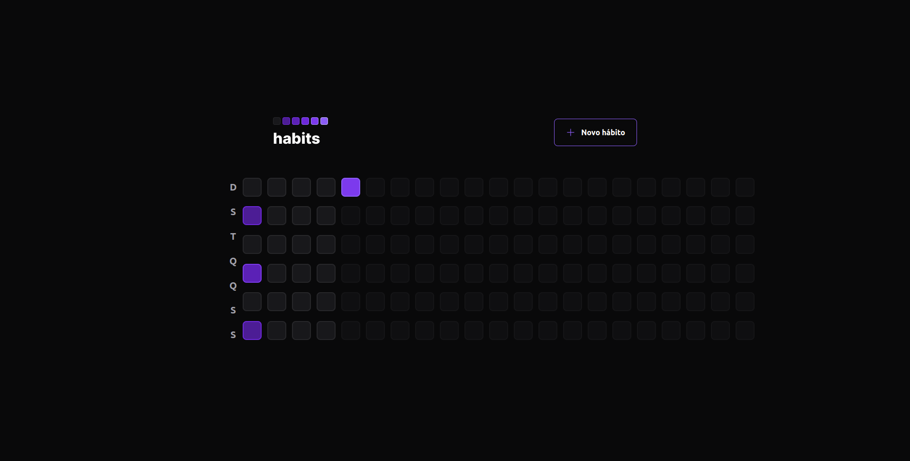

Ao clicar no botão `Novo hábito`, o modal abaixo será exibido para o usuário inserir um título e os dias da semana em que o novo hábito deve ser realizado:

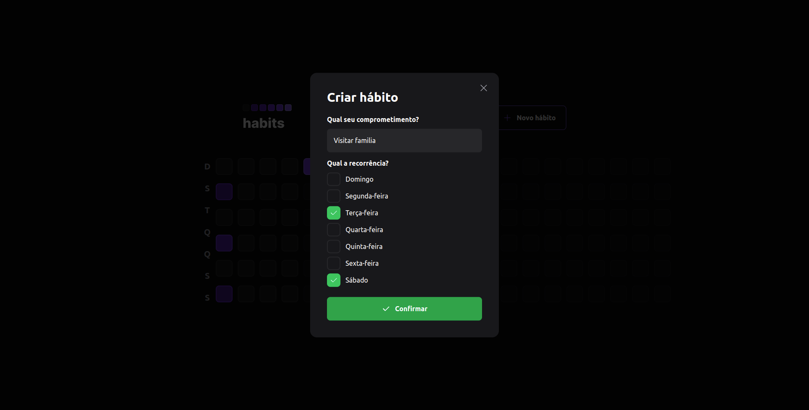

Ao clicar em algum dos dias as informações dele serão exibidas, por exemplo: a sua data numérica, o dia da semana, a barra de progresso e a lista de hábitos que devem ser realizados no respectivo dia da semana, conforme imagem a seguir:

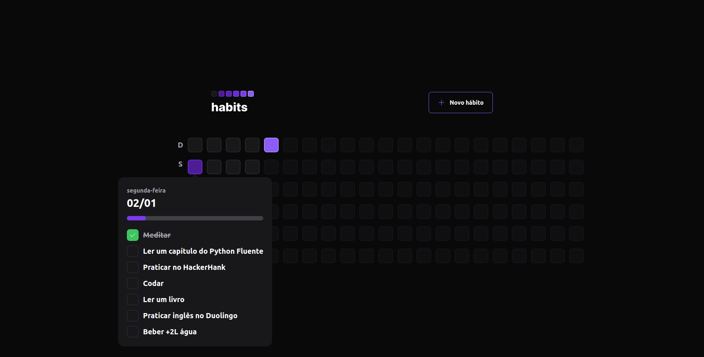

Note que o quadrado do dia acima é mais escuro do que o da imagem a seguir. Isso se deve ao fato de que no dia abaixo a porcentagem de hábitos realizados foi maior:

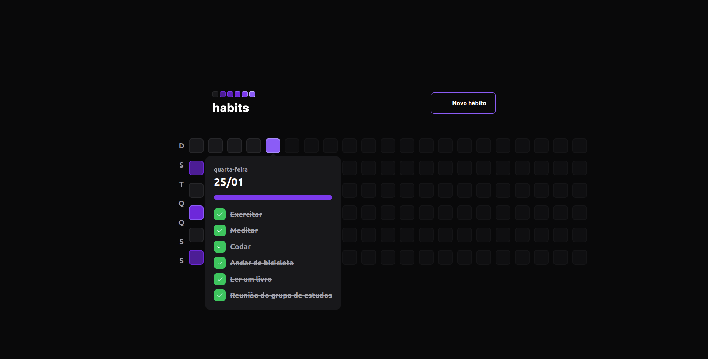

Com isso conhecemos todos os fluxos da interface web ao utilizarmos a aplicação. Deixo abaixo um GIF de demonstração da aplicação sendo utilizada aonde passo por todas as funcionalidades acimas citadas:

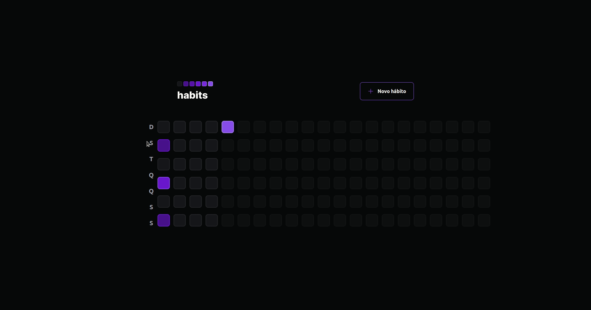

### Habits - Aplicação mobile

As funcionalidades da aplicação mobile são as mesmas da web, portanto mostrarei as telas com menos explicações para evitar redundância e me atentarei somente à pequenos detalhes caso existam e sejam relevantes de serem citados.

Assim como na web, ao acessar a aplicação o usuário irá se deparar com os 'quadradinhos' que representam os dias com as colorações baseadas em seus respectivos progressos, como vemos abaixo:

|                           Splash Screen                           |                              Home vazia                               |                       Home com progresso                        |
| :---------------------------------------------------------------: | :-------------------------------------------------------------------: | :-------------------------------------------------------------: |
| 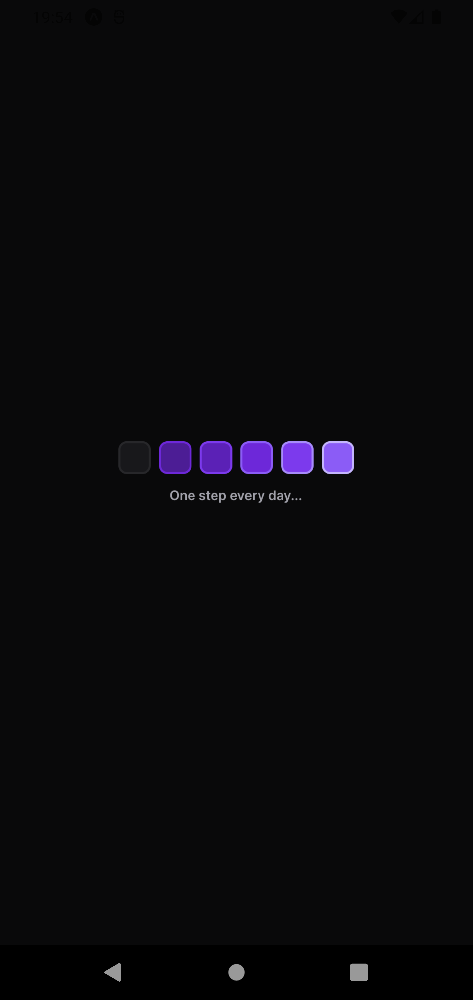 | 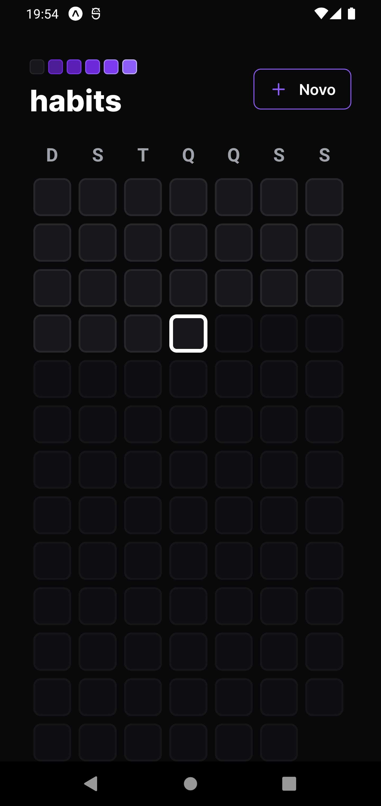 | 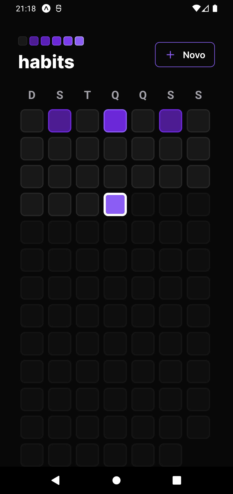 |

Diferentemente da web, ao clicar em algum dia para ver os detalhes não teremos o popover com seus detalhes e sim o redirecionamento para uma tela aonde essas informações serão exibidas. A seguir veremos as telas aonde temos um dia sem hábitos vinculados, um dia com hábitos parcialmente concluídos e um dia totalmente concluído, respectivamente:

|                               Dia sem hábitos                                |                            Dia parcialmente concluído                            |                           Dia totalmente concluído                            |
| :--------------------------------------------------------------------------: | :------------------------------------------------------------------------------: | :---------------------------------------------------------------------------: |
| 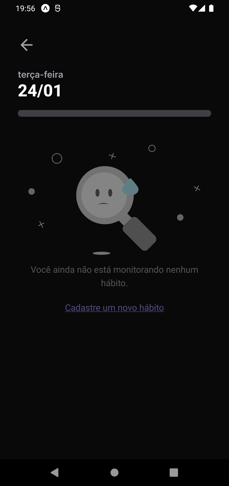 | 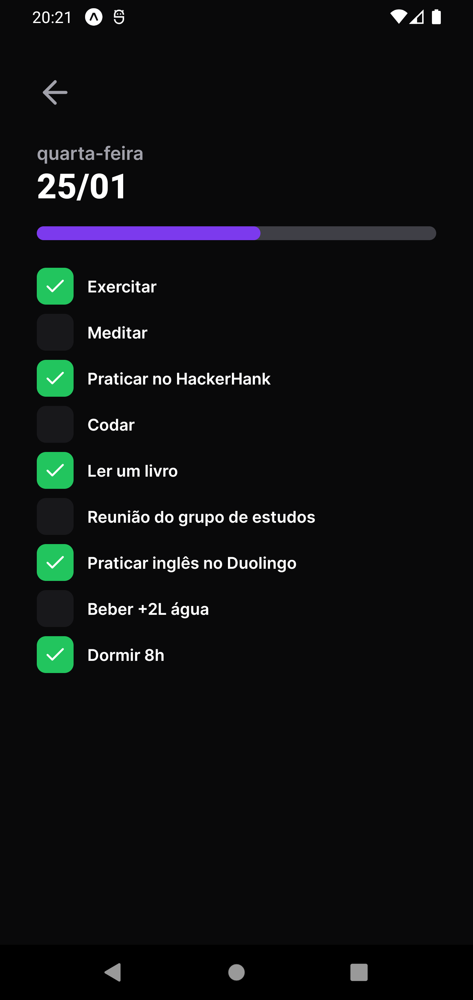 | 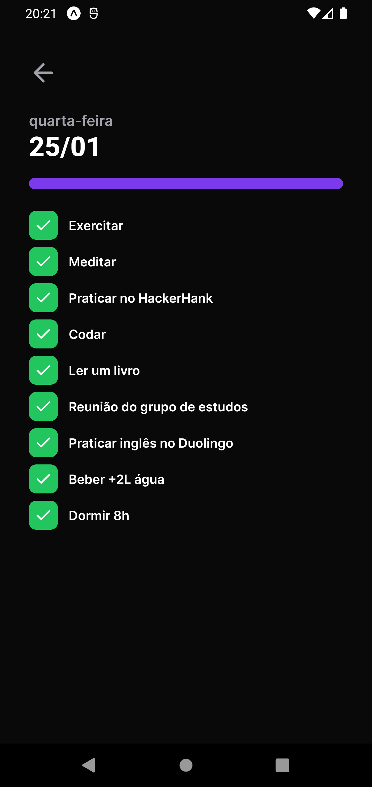 |

Na Home e na tela de dia sem hábitos temos botão e link, respectivamente, que irá nos direcionar para o formulário de criação de um novo hábito.
As informações necessárias são as mesmas da web e abaixo temos o fluxo de cadastro ilustrado:

|                                 Form vazio                                 |                           Form preenchido                            |                               Cadastro concluído                               |
| :------------------------------------------------------------------------: | :------------------------------------------------------------------: | :----------------------------------------------------------------------------: |
| 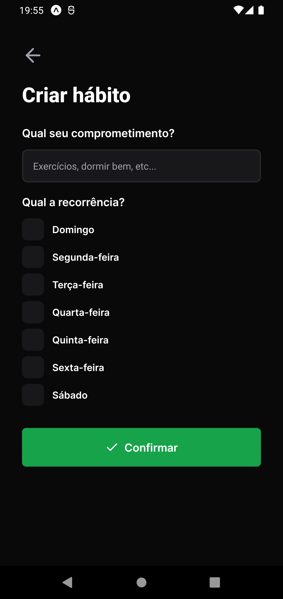 | 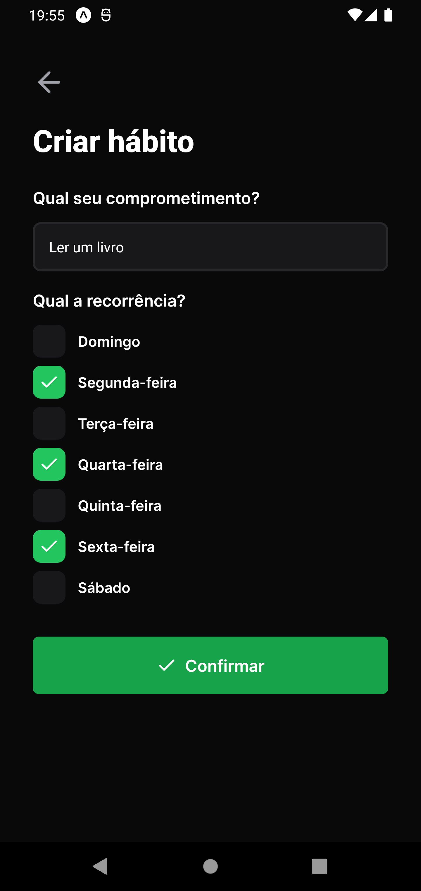 | 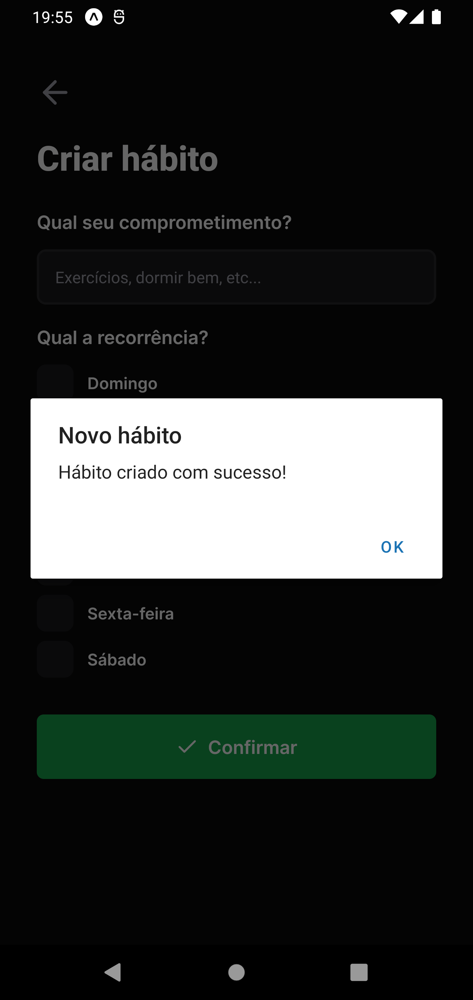 |

Com isso concluímos nosso tour pela aplicação mobile! 🙂
Assim como na web, deixo abaixo um GIF navegando pela aplicação e passando por todos seus fluxos e também a demonstração das animações presentes no App:


## Instalação

Antes de começar, você vai precisar ter instalado em sua máquina as seguintes ferramentas:
[Git](https://git-scm.com), [Node.js](https://nodejs.org/en/).
Além disso é bom ter um editor para trabalhar com o código como [VSCode](https://code.visualstudio.com/).

> ⚠ Antes de executar o frontend e mobile verificar o IP da sua máquina e configurar no arquivo de setup do axios presente na pasta lib dos respectivos projetos

### 🎲 Rodando o Back End (servidor)

```bash
# Clone este repositório
$ git clone git@github.com:MrRioja/nlw-setup.git

# Acesse a pasta do projeto no terminal/cmd
$ cd nlw-setup

# Vá para a pasta server
$ cd server

# Instale as dependências
$ npm install
# Caso prefira usar o Yarn execute o comando abaixo
$ yarn

# Execute a aplicação em modo de desenvolvimento
$ npm run dev
# Caso prefira usar o Yarn execute o comando abaixo
$ yarn dev

# O servidor inciará na porta 3333 - acesse <http://localhost:3333>
```

### 🖥️ Rodando o Front End (Web)

```bash
# Clone este repositório
$ git clone git@github.com:MrRioja/nlw-setup.git

# Acesse a pasta do projeto no terminal/cmd
$ cd nlw-setup

# Vá para a pasta web
$ cd web

# Instale as dependências
$ npm install
# Caso prefira usar o Yarn execute o comando abaixo
$ yarn

# Execute a aplicação em modo de desenvolvimento
$ npm run dev
# Caso prefira usar o Yarn execute o comando abaixo
$ yarn dev

# O servidor inciará na porta 5173 - acesse <http://localhost:5173>
```

### 📱 Rodando o App (Mobile)

```bash
# Clone este repositório
$ git clone git@github.com:MrRioja/nlw-setup.git

# Acesse a pasta do projeto no terminal/cmd
$ cd nlw-setup

# Vá para a pasta mobile
$ cd mobile

# Instale as dependências
$ npm install
# Caso prefira usar o Yarn execute o comando abaixo
$ yarn

# Execute a aplicação
$ yarn start

# Será aberto no terminal o menu do Expo onde poderá scanear o QR Code para executar o app diretamente no seu celular ou as opções de executar no emulador android ou iOS
```

## Tecnologias


<br><br><br><br>

## Autor

<div align="center">

<h1>Luiz Rioja</h1>
<strong>Backend Developer</strong>
<br/>
<br/>

<a href="https://linkedin.com/in/luizrioja" target="_blank">

</a>

<a href="https://github.com/mrrioja" target="_blank">

</a>

<a href="mailto:lulyrioja@gmail.com?subject=Fala%20Dev" target="_blank">

</a>

<a href="https://api.whatsapp.com/send?phone=5511933572652" target="_blank">

</a>

<a href="https://join.skype.com/invite/tvBbOq03j5Uu" target="_blank">

</a>

<br/>
<br/>
</div>
